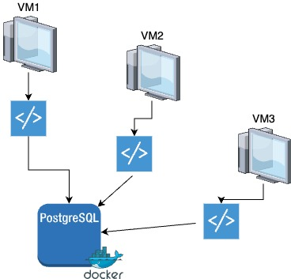

<!-- # Linux Cluster Monitoring Agent -->
<!-- Automated logging of hardware specs and usage of Linux Cluster nodes using Docker, PostgreSQL, and Bash scripting. -->

# Introduction
<!-- (about 100-150 words)
Discuss the design of the project. What does this project/product do? Who are the users? What are the technologies you have used? (e.g. bash, docker, git, etc..) -->
Linux administrators often require monitoring the resource usage (e.g. CPU, memory, and disk) of each cluster node in real time, for logging and resource planning purposes. Thankfully, it is easy to create Bash scripts to automate such a process. The _Linux Cluster Monitoring Agent ™_ leverages Docker to provision a Postgres Database to support automated logging and admin querying using SQL. System information is captured and parsed using ```vmstat```, ```cpuinfo```, ```meminfo```, and ```df```. ```crontab``` is used to automatically update the _host usage_ table every minute via SQL. The scripts are tested on a remote GCP virtual server running on Rocky Linux.

# Quick Start

Clone the repository to your local Linux machine using the following command or by clicking on the "<span style="color: green;"><> Code</span>" button to the top-right and choosing to download ZIP.

```bash
git clone https://github.com/jarviscanada/jarvis_data_eng_TianjianGao
```

Change to the scripts directory:

```bash
cd /jarvis_data_eng_TianjianGao/linux_sql/scripts
```

<!-- - Start a psql instance using psql_docker.sh -->
Start a PostgreSQL (PSQL) Docker instance using the _psql_docker.sh_ script. Note that Docker and PSQL should be installed on your system. [Install Docker](https://docs.docker.com/engine/install/) [Install PSQL](https://www.postgresql.org/download/)

```bash
# Update exec permission for the script
chmod +x psql_docker.sh 

# Execute the script. cmd={create|start|stop}
# By default: db_username=postgres and db_password=password
./psql_docker.sh <cmd> <db_username> <db_password> 
```

<!-- - Create tables using ddl.sql -->
If not already created, use the _ddl.sql_ script under the _sql_ directory to initialize the _host_info_ table for storing the system specs (CPU model, speed, memory info, etc.) and _host_usage_ table for logging the system usage.

Then, insert hardware specs data into the DB using host_info.sh

```bash
# Update exec permission for the script
chmod +x host_info.sh 

# Execute the script
# By default: psql_host=localhost, psql_port=5432, db_name=host_agent, psql_user=postgres, psql_password=password
./host_info.sh <psql_host> <psql_port> <db_name> <db_username> <db_password>
```

Then, insert hardware usage data into the DB manually using host_usage.sh

```bash
# Update exec permission for host_usage.sh
chmod +x host_usage.sh 

# Execute the script
# By default: psql_host=localhost, psql_port=5432, db_name=host_agent, psql_user=postgres, psql_password=password
./host_info.sh <psql_host> <psql_port> <db_name> <db_username> <db_password>
```

Or automate usage logging by setting up `crontab`

```bash
# Run the following command to edit crontab jobs
crontab -e

# Add the following line to the crontab inside the editor
# Change the directory accordingly your setup
# By default: psql_host=localhost, psql_port=5432, db_name=host_agent, psql_user=postgres, psql_password=password
* * * * * bash /home/rocky/dev/jarvis_data_eng_TianjianGao/linux_sql/host_agent/scripts/host_usage.sh localhost 5432 host_agent postgres password > /tmp/host_usage.log

# Use the following command to verify the new crontab job
crontab -l
```

# Implementation
<!-- Discuss how you implement the project. -->

## Architecture
<!-- Draw a cluster diagram with three Linux hosts, a DB, and agents (use draw.io website). Image must be saved to the `assets` directory. -->

<figure>

<figcaption>Illustration of automated agents updating VM info to a shared Postgres Database running on Docker</figcaption>
</figure>

## Scripts

Shell script description and usage:

- `psql_docker.sh`: for creating/starting/stopping the Postgres Docker container.
- `host_info.sh`: for adding the host machine’s information to Postgres.
- `host_usage.sh`: for adding the host machine’s CPU, RAM, and disk usage to Postgres.
- `crontab`: for automating snapshots of system usage.
- `ddl.sql`: for initializing the host_agent PSQL tables.

## Database Modelling
<!-- Describe the schema of each table using markdown table syntax (do not put any sql code) -->

`host_info`

| Field | Data Type | Description |
| --- | --- | --- |
| `id` | SERIAL NOT NULL | Unique ID of the host machine |
| `hostname` | VARCHAR NOT NULL | Unique name of the host machine `$hostname -f` |
| `cpu_number` | INT2 NOT NULL | # of CPU cores, e.g. 2, 4 |
| `cpu_architecture` | VARCHAR NOT NULL | e.g. aarch64, x86_84 |
| `cpu_model` | VARCHAR NOT NULL | e.g. Intel(R) Xeon(R) CPU |
| `cpu_mhz` | FLOAT8 NOT NULL | e.g. 2200.14 |
| `l2_cache`| INT4 NOT NULL | Size of the L2 cache in kb, e.g. 256 |
|`timestamp`| TIMESTAMP NULL | Date & time of system snapshot, e.g. `2019-05-29 17:49:53` |
|`total_mem`| INT4 NULL | Size of the memory (RAM) in MB |

```sql
# host_info table constraints
CONSTRAINT host_info_pk PRIMARY KEY (id),
CONSTRAINT host_info_un UNIQUE (hostname)
```

`host_usage`

| Field | Data Type | Description |
| --- | --- | --- |
| `timestamp` | TIMESTAMP NOT NULL | Date & time of the host_usage snapshot taken |
| `host_id` | SERIAL NOT NULL | Same as in host_info, foreign key |
| `memory_free` | INT4 NOT NULL | Amount of free memory in MB |
| `cpu_idle` | INT2 NOT NULL | Percentage % CPU on idle
| `cpu_kernel` | INT2 NOT NULL | Percent % of CPU time spent on system processes (kernel code) |
| `disk_io` | INT4 NOT NULL | Number of tasks being read |
| `disk_available`| INT4 NOT NULL | Total available storage |

```sql
CONSTRAINT host_usage_host_info_fk FOREIGN KEY (host_id) REFERENCES host_info(id)
```

Here `host_id` is the primary and foreign key in `host_info` and `host_usage`, bridging the two tables.

# Test
<!-- How did you test your bash scripts DDL? What was the result? -->
In sum, all the scripts were manually tested to ensure the intended functions are working and errors are thrown when missing arguments. The PSQL data entries are verified to make sure the correct information is captured and the correct Linux commands are used.

## psql_docker.sh

- Tested creating, starting, and stopping the Docker container.
- Tested with missing arguments.

## host_info.sh

- Validated each Bash command for capturing the desired system specs manually in Terminal.
- Verified the host_info table in PSQL DB manually.

## host_usage.sh

- Validated each Bash command for capturing the desired system specs manually in Terminal.
- Verified the host_usage table in PSQL DB manually.
- Tested if the SQL command could correctly identify the host_id using a `join` statement with host_info.

# Deployment
<!-- How did you deploy your app? (e.g. Github, crontab, docker) -->
The monitoring agent is deployed jointly using Docker, crontab, and GitHub.
First, Docker is used to provision the Postgres database and persist the usage data. Second, crontab is used to deploy the agent in a Linux environment and allows for the capture of system usage every minute. Lastly, new development is committed, pushed, and hosted using GitHub. New features are developed under the _feature_ branch, which is then merged to the _development_ branch and then to the _main_ branch.

# Improvements

- Create a Bash script to automate installing Docker and PostgreSQL on popular Linux distros such as Debian, RHEL, and Ubuntu.
- Use functions in scripts to improve the reusability and readability of the scripts. Add more code comments.
- Create an application to configure the interval of scheduled tasks in crontab.
